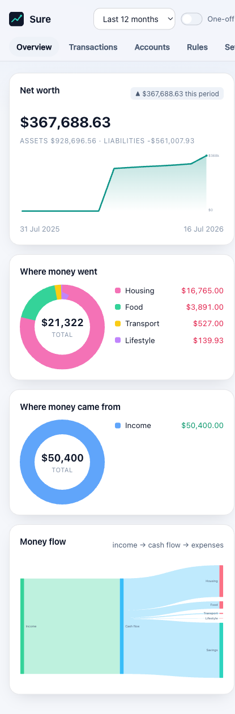
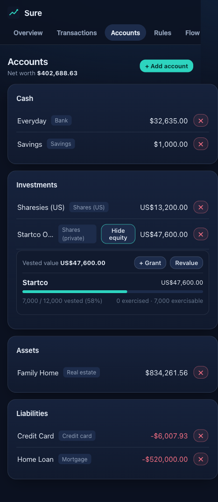
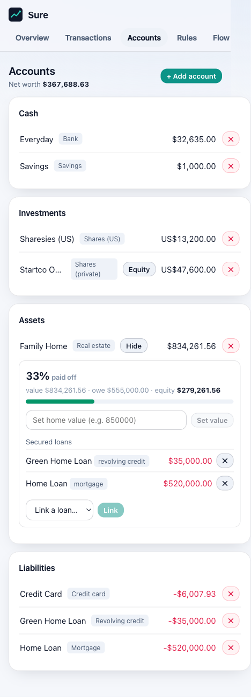

# Sure

A fast, local, single-family financial tracker. Rust + Axum + SQLite backend, a tiny
Svelte SPA you can install to your iPhone home screen, and a fully type-safe client
generated from the backend's OpenAPI spec.

Designed to run behind a firewall on your own hardware — **no logins, no cloud, no
multi-tenant scale**. Heavy work (aggregation, currency normalisation, rules, vesting
math) happens on the backend so the frontend stays a ~34 KB gzipped bundle that flies
on old devices.

| Overview (net worth, spend, money-flow) | Accounts + share vesting | Property paid-off % |
| --- | --- | --- |
|  |  |  |

## Features

**Money model**
- Transactions with categories, **merchants**, notes, a one-off flag, and transfer linking.
- Nested categories (income / expense / transfer) with a real tree.
- First-class custom **merchants** (payees) with an optional default category; assignable
  inline or automatically via rules.
- Accounts of every kind: bank, savings, credit card, revolving credit, mortgage,
  student loan, vehicle, real estate, shares (NZ / US / **private with vesting**).
- Multi-currency, normalised into a configurable base currency for reports.
- Point-in-time valuations for assets/liabilities → net-worth history.
- **Property equity**: link a home's mortgage, revolving credit, and other loans (e.g. a
  green-loan program) as its secured debt, and see total debt, equity, and **paid-off %**.

**Agent access (MCP)**
- An [MCP](https://modelcontextprotocol.io) server on the same port, so Claude (or any MCP
  client) can answer "what did grocery spend do after we switched supermarkets" against the
  real ledger — and, behind a second opt-in, file transactions and write rules. Aggregation
  happens server-side so nothing pulls four thousand rows to add them up, and the one tool
  that can change many rows at once refuses to write until it has told you the count and been
  told it back. **Off by default**, and gated twice: `SURE_MCP` sets a ceiling on the host,
  and the working mode is a setting in the app (Settings → Preferences) that can only choose
  within it — changes apply with no restart. Turning it on sends transaction memos to a model
  provider, which is a real departure from the rest of this app. See
  [docs/MCP.md](docs/MCP.md).

**Automation**
- **Rules** with a nested-logic [Zen expression](https://gorules.io) engine
  (`is_expense and contains(lower(description), 'countdown')`). A rule can set a category,
  a **merchant**, and/or the one-off flag. Preview before saving, run / re-run, and
  **undo** any run — every change is recorded in an audit log.
- **Config backup**: export the whole configuration + data as a JSON snapshot and
  re-import it (ids preserved, destructive).
- **Scheduled adjustments** ("crons"): e.g. *the house appreciates 1%/yr, applied
  monthly*, or a recurring subscription. Idempotent, and each applied period is undoable.
- **Equity vesting**: multiple grants across multiple companies, cliff + linear-monthly
  vesting, exercises, and intrinsic value that rolls into net worth.
- **Provider trait**: a generic Rust interface to pull transactions from external
  sources, with a credential-free CSV importer as the reference implementation
  (dedupes on re-sync). Providers that expose credentialed APIs can also discover
  upstream accounts and link them to a new or existing local account — see the Akahu
  (NZ open banking) implementation, which additionally auto-syncs on a schedule.
- **One import for every file**, for sources with no usable API: an ASB transaction
  export, myIR student-loan workbooks, a Sharesies export zip, or a plain CSV. Drop the
  files in one place and Sure works out what each one is — no picking an importer, no
  hunting for the right button. Everything is previewed before it writes, routed to the
  account it belongs to (from a previous import, a stored account number, or by hand),
  reported account by account, idempotent on re-upload, and reversible afterwards. See
  [docs/IMPORT.md](docs/IMPORT.md).
- **History past the bank feed**: a bank's own export reaches about seven years where
  open banking serves two, so a cash/card account's history can be extended behind its
  feed — and rows the feed already covers are held back automatically, so nothing is
  counted twice. Select every account's export at once; each is routed and reported
  separately.
- **Balance-only accounts get a ledger anyway**: where an upstream reports a balance
  but no transactions (an IR student loan), a daily task differences the balance
  series into transactions, so week-to-week movement is visible.

**Reports & UI**
- Net-worth line over time, income/expense donut per category, and a **Sankey**
  money-flow diagram — all computed server-side.
- Global time-range filter (last month / 90 days / YTD / 12 months / all time) and a
  one-off toggle.
- Installable PWA (iPhone "Add to Home Screen").

## Running it

One container serves both the API and the SPA:

```bash
docker run --rm -p 8080:8080 -v sure-data:/data ghcr.io/josiahbull/sure:latest
```

The image is ~28 MB and contains the statically-linked binary, the built SPA, and a CA
bundle — and nothing else. No shell, no package manager, no libc, no `curl`, no coreutils:
`gcr.io/distroless/static` plus a musl build, so the only executable in it is `sure-api`
itself. That is most of the point. A container whose only program is the one you meant to
run has nowhere to go if the process is ever compromised, and there is no distro package
stream underneath it to track CVEs against.

Or run the binary directly, pointed at the built SPA:

```bash
WEB_DIR=packages/web/dist DATABASE_URL=sqlite:data/sure.db ./target/release/sure-api
```

### Configuration

Configuration is via environment variables — or a `.env` beside the binary or above it,
which the server loads on startup unless `SURE_ENV_FILE` says otherwise. See
[`.env.example`](.env.example) for the full list; the ones most worth knowing:

| Var | Default | What it does |
| --- | --- | --- |
| `DATABASE_URL` | `sqlite:data/sure.db` | Where the database lives |
| `BIND_ADDR` | `127.0.0.1:8080` | Address to listen on |
| `WEB_DIR` | *(unset)* | Serve the SPA from this directory |
| `RUST_LOG` | `info` | Log filter |
| `SURE_COLOR` | `never` | ANSI colour in the logs — `never`/`auto`/`always`. Off by default because `docker logs`, `journalctl` and the like don't interpret the escapes; `auto` colours only when stdout is a terminal |
| `BACKGROUND_TASKS` | on | Set to `off` to stop the scheduler (exchange rates, provider polling, stock prices, transfer linking) |
| `SURE_MCP` | `off` | Ceiling on the MCP endpoint at `/mcp` — `off`/`read`/`write`, with the working mode chosen in the app ([docs/MCP.md](docs/MCP.md)) |
| `SURE_SANDBOX` | `best-effort` | Set to `enforce` to refuse to start if the kernel can't apply the whole sandbox |
| `CORS_ALLOWED_ORIGINS` | the author's own hostname + Vite's dev origins | Set it **empty** for the deployment above — the SPA is same-origin, so nothing needs cross-origin access, and the default allowlist names a host that isn't yours |

The HTTP layer — cache directives, compression, h2c, and the abuse guards — is described
in [docs/HTTP.md](docs/HTTP.md), along with every env var that tunes it. The defaults are
the intended settings.

On Linux the process sandboxes itself with [Landlock](https://landlock.io) before it opens
the database or binds a socket: writable access to the data directory and nothing else,
read access to the SPA directory and the system config it needs, no `execve` anywhere, and
outbound TCP limited to 443 and 53. It needs no privileges and nothing on the host. The
policy, its two deliberate compromises, and the rest of the `SURE_SANDBOX_*` vars are in
[docs/SANDBOX.md](docs/SANDBOX.md).

### Bank feeds (Akahu)

For the Akahu bank-feed provider (NZ accounts + transactions), set `AKAHU_APP_TOKEN` and
`AKAHU_USER_TOKEN` in the environment or in `.env` (from your Akahu personal-app
dashboard) — without these, "akahu" still appears as a provider kind but discovery/sync
fail with a clear error naming the missing var. No OAuth redirect flow is implemented;
these are the static tokens Akahu issues directly for personal-app use.

## Development

Prerequisites, the dev server, the command reference, the workspace layout and the testing
tiers are in [docs/DEVELOPMENT.md](docs/DEVELOPMENT.md). Contributor conventions are in
[CLAUDE.md](CLAUDE.md).

## License

[AGPL-3.0-only](LICENSE).

Not a permissive licence by preference but by inheritance: parts of the web layer —
notably the account-subtype table, the palette and the design tokens in
`packages/web/src/lib/accountSubtypes.ts`, `accountMeta.ts` and `app.css` — were
transcribed from [we-promise/sure](https://github.com/we-promise/sure), which is
AGPL-3.0. That makes this a derivative work, so it cannot be relicensed more
permissively. Comments naming "the reference" throughout the web layer mark the passages
concerned. This project is an independent Rust/Svelte rewrite and is not affiliated with,
endorsed by, or supported by that project or its authors.

`-only` rather than `-or-later`: upstream ships the bare licence text with no "or later"
grant, so none is passed on.

### Bundled third-party assets

- **Geist** and **Geist Mono** (`packages/web/public/fonts/`) — © 2024 The Geist Project
  Authors, under the [SIL Open Font License 1.1](packages/web/public/fonts/OFL.txt). The
  fonts are *not* covered by the AGPL above; OFL clause 2 requires that licence to travel
  with them, which is why the text is vendored beside the `.woff2` files.
- **Lucide** icons (`packages/web/src/lib/icons.ts`) — ISC.
